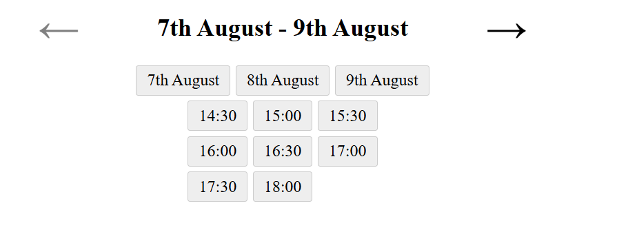
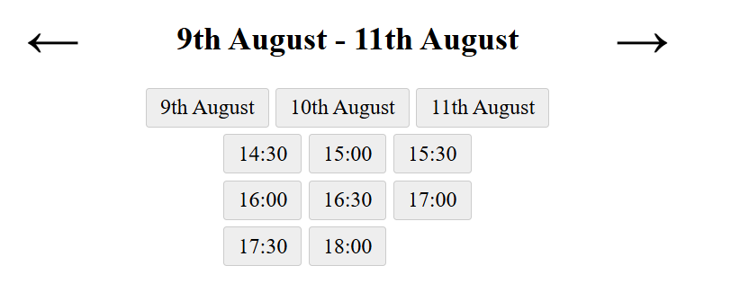
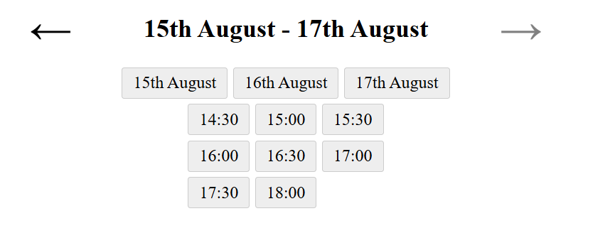

# (Be-Ta)Calendar
## What is it?
betaCalendar is a functional, albeit much more basic, alternative to flatPicker.

## What's it's Unique Selling Point? i.e... why should I care?
betaCalendar makes it possible to easily integrate with the google calendar API for dates AND times. Additionally, I find it much easier to know what time slots are availalble to be booked.

## How to install
npm install betacalendar OR
npm install augustusdog/betaCalendar#main

## How to use
After installing, initialise the calendar using:

`betaCalendar.makeChanges(start, end, window_size, time_slot_start, time_slot_end, time_slot_interval)`

* start (int): the date you wish your calendar to start from. For example, if I only wished to take booking from tomorrow onwards, I would set start to 1 - because tomorrow is 1 day from today.
* end (int): the date you wish your calendar to end. For example, if I only wish that customer can book two weeks out I would set end to 14.
* window_size (int): the number of dates you wish to show at any given time. For example, on a mobile device I may want that to be 2, whereas on a desktop I may prefer 4.
* time_slot_start (string): the time do you wish to take bookings from. For example, if I took bookings from 14:30, I would enter "14:30".
* time_slot_end( (string): the time do you wish to take bookings until. For example, if I took bookings until 19:30, I would enter "19:30".
* time_slot_interval (int): the time you wish to allocate to each booking. For example, if I expect each meeting to take 30 minutes I would use a value of 30.

## Screenshotted examples
### Lower bound

### Mid bound

### Upper bound

## Going forward
If you decide to add any functionality / to make any improvements, please do. I will happily review any improvements and push them to the main branch/npm.
